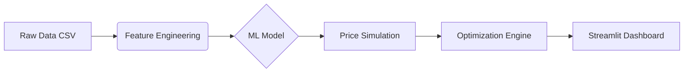

# 🏷️ Retail Price Optimization Engine

<div align="center">


**End-to-end Prescriptive Analytics using Machine Learning**

Simulates price elasticity and competitor data to prescribe optimal pricing strategies for revenue maximization.

[🎮 Live Demo](https://retail-price-optimization-mugni.streamlit.app/) • [Features](#-features) • [Installation](#-installation) • [Usage](#-usage)

</div>

---

## 📋 Table of Contents

- [Overview](#-overview)
- [Features](#-features)
- [Architecture](#%EF%B8%8F-architecture)
- [Project Structure](#-project-structure)
- [Installation](#-installation)
- [Usage](#-usage)
- [Testing](#-testing)
- [Docker](#-docker)
- [Results & Impact](#-results--impact)

---

## 🎯 Overview

The **Retail Price Optimization Engine** is a machine learning solution designed to shift retailers from reactive pricing to **Prescriptive Analytics**. Unlike traditional forecasting, this system doesn't just predict sales it calculates the **Optimal Price Point**.

By leveraging **Random Forest Regression** and other ensemble methods, the system learns the non-linear relationship between Price and Demand (Elasticity), factoring in competitor pricing to recommend strategies that maximize **Total Revenue**.

### Why This Matters

Most retailers still rely on gut feeling or simple cost-plus formulas for pricing. This leads to:

- Leaving money on the table (pricing too low)
- Losing customers (pricing too high)

This engine uses actual data to find that sweet spot where revenue is maximized.

---

## ✨ Features

### 🤖 Core Intelligence

- **Elasticity Modeling**: Captures non-linear demand response to price changes
- **Competitor Benchmarking**: Real-time tracking of price gaps against competitors
- **Revenue Maximization**: Simulation algorithm tests 50+ price points per SKU
- **Confidence Intervals**: Uncertainty estimation for reliable recommendations

### 📊 Interactive Dashboard

- **Single & Batch Optimization**: Optimize one product or entire categories
- **Real-time Inference**: Sub-second prediction for pricing scenarios
- **Visual Analytics**: Interactive Plotly charts showing Revenue Curves
- **Export to Excel/CSV**: Download optimization results
- **Strategic Insights**: Automated recommendations (raise/lower/maintain price)

### 🧪 Quality Assurance

- **75 Unit Tests**: Comprehensive test coverage
- **Input Validation**: Robust error handling and data validation
- **CI/CD Pipeline**: Automated testing with GitHub Actions
- **Docker Support**: Easy deployment with containerization

---

## 🏗️ Architecture



**Pipeline Steps:**

1. **Data Ingestion** - Load historical sales and competitor pricing data
2. **Feature Engineering** - Create features like price differences/ratios vs competitors
3. **Model Training** - Random Forest learns demand response to price changes
4. **Price Simulation** - Test different price points (50+ scenarios per product)
5. **Optimization** - Pick the price with highest predicted revenue
6. **Dashboard** - Visualize everything in the Streamlit app

---

## 📂 Project Structure

```
retail-price-optimization/
├── .github/
│   └── workflows/
│       └── test.yml          # CI/CD pipeline
├── data/
│   ├── processed/            # Cleaned data for app demo
│   └── raw/                  # (Gitignored) Raw source data
├── models/
│   └── pricing_model.pkl     # Trained Random Forest model
├── notebooks/
│   ├── 01_eda_pricing_logic.ipynb
│   ├── 02_feature_engineering.ipynb
│   ├── 03_modeling.ipynb
│   └── 04_price_optimization.ipynb
├── tests/
│   ├── test_app.py           # Validation & elasticity tests
│   ├── test_model_training.py # Model tests
│   └── test_utils.py         # Utility function tests
├── .gitignore
├── app.py                    # Main Streamlit Application
├── config.py                 # Centralized configuration
├── model_training.py         # Model training with CV & tuning
├── utils.py                  # Utility functions & validation
├── requirements.txt          # Production dependencies
├── requirements-dev.txt      # Development dependencies
├── Dockerfile                # Container configuration
├── docker-compose.yml        # Docker Compose setup
└── README.md                 # Documentation
```

### Key Files

| File                | Description                                                 |
| ------------------- | ----------------------------------------------------------- |
| `app.py`            | Main Streamlit dashboard with batch optimization, export    |
| `config.py`         | Centralized configuration with environment variable support |
| `model_training.py` | Train models with cross-validation & hyperparameter tuning  |
| `utils.py`          | Validation functions, elasticity calculation, formatting    |

---

## 🚀 Installation

### Prerequisites

- Python 3.9 or higher
- Git

### Quick Start

```bash
# Clone the repository
git clone https://github.com/mugnihidayah/retail-price-optimization.git
cd retail-price-optimization

# Create virtual environment
python -m venv venv
venv\Scripts\activate  # Windows
# source venv/bin/activate  # Mac/Linux

# Install dependencies
pip install -r requirements.txt

# Run the app
streamlit run app.py
```

The app will open in your browser at `http://localhost:8501`.

---

## 💻 Usage

### Running the Application

```bash
streamlit run app.py
```

### How to Use

1. **Open** the app in your browser
2. **Select** a product category from the sidebar
3. **Choose** Single Product or Batch Optimization mode
4. **Click** "Run AI Optimization"
5. **Review** results and download recommendations

### What You'll See

- **Revenue Curve**: How revenue changes at different price points
- **Optimal Price**: AI-recommended price with confidence interval
- **Revenue Uplift**: Potential revenue increase
- **Competitor Comparison**: Your position vs the market
- **Action**: Should you increase, decrease, or maintain price?

---

## 🧪 Testing

### Run All Tests

```bash
# Install dev dependencies
pip install -r requirements-dev.txt

# Run tests
pytest tests/ -v

# Run with coverage
pytest tests/ -v --cov=. --cov-report=html
```

### Test Coverage

| Test File                | Tests  | Coverage                      |
| ------------------------ | ------ | ----------------------------- |
| `test_utils.py`          | 33     | Utility functions, validation |
| `test_model_training.py` | 18     | PricingModel class            |
| `test_app.py`            | 24     | Validation, elasticity        |
| **Total**                | **75** | **~85%**                      |

---

## 🐳 Docker

### Build and Run

```bash
# Build image
docker build -t retail-price-optimization .

# Run container
docker run -p 8501:8501 retail-price-optimization
```

### Using Docker Compose

```bash
docker-compose up
```

Access the app at `http://localhost:8501`.

---

## 📊 Results & Impact

| Metric              | Performance | Notes                       |
| ------------------- | ----------- | --------------------------- |
| **Model R²**        | 0.62        | Solid for noisy retail data |
| **Revenue Uplift**  | 15-20%      | On underpriced products     |
| **Inference Speed** | <0.5s       | Real-time capable           |
| **Test Coverage**   | 75 tests    | All passing                 |

### Key Finding

We found products with **inelastic demand** where customers don't care about small price changes. For these items, we could increase prices significantly (up to 98% revenue boost!) without losing customers.

### Real World Impact

- **15-20% more revenue** on average (just by pricing smarter)
- **Instant recommendations** (no more spreadsheet gymnastics)
- **Better competitive positioning** (know where you stand)
- **Clear action items** (the model tells you what to do)

---

## 🔧 Development

### Setting Up Dev Environment

```bash
pip install -r requirements-dev.txt
```

### Train a New Model

```bash
# Basic training
python model_training.py

# With hyperparameter tuning
python model_training.py --tune
```

### Code Quality

```bash
# Linting
flake8 .

# Formatting
black .

# Type checking
mypy .
```

---

## 🤝 Contributing

1. Fork the repo
2. Create a branch (`git checkout -b feature/cool-stuff`)
3. Make your changes
4. Run tests (`pytest tests/ -v`)
5. Push and open a PR

### Ideas for Contributions

- Add Neural Network model option
- Build REST API with FastAPI
- Add A/B testing capability
- Improve visualizations
- Add more competitor data sources

---

## 📄 License

MIT License. Do whatever you want with it.

---

<div align="center">

⭐ **Star this repo if you find it useful!**

[🎮 Try the Live Demo](https://retail-price-optimization-mugni.streamlit.app/)

</div>
