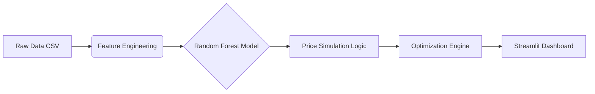

# 🏷️ Retail Price Optimization Engine

<div align="center">


**End-to-end Prescriptive Analytics using Random Forest**

Simulates price elasticity and competitor data to prescribe optimal pricing strategies for revenue maximization.

[Features](#-features) • [Installation](#-installation) • [Usage](#-usage) • [Results](#-results--impact)

</div>

---

## 📋 Table of Contents

- [Overview](#-overview)
- [Features](#-features)
- [Architecture](#%EF%B8%8F-architecture)
- [Project Structure](#-project-structure)
- [Installation](#-installation)
- [Usage](#-usage)
- [Results & Impact](#-results--impact)
- [Contact](#-contact)

---

## 🎯 Overview

The **Retail Price Optimization Engine** is a machine learning solution designed to shift retailers from reactive pricing to **Prescriptive Analytics**. Unlike traditional forecasting, this system doesn't just predict sales but it calculates the **Optimal Price Point**.

By leveraging **Random Forest Regression**, the system learns the non-linear relationship between Price and Demand (Elasticity), factoring in competitor pricing to recommend strategies that maximize **Total Revenue**.

Why does this matter? Most retailers still rely on gut feeling or simple cost-plus formulas for pricing. This leads to leaving money on the table (pricing too low) or losing customers (pricing too high). This engine uses actual data to find that sweet spot where revenue is maximized.

---

## ✨ Features

### 🤖 Core Intelligence
- **Elasticity Modeling**: Captures non-linear demand response to price changes.
- **Competitor Benchmarking**: Real-time tracking of price gaps against top 3 competitors (`diff_competitor`, `ratio_competitor`).
- **Revenue Maximization**: Simulation algorithm tests 50+ price points per SKU to find the "Sweet Spot".

### 📊 Interactive Dashboard (Streamlit)
- **Product Portfolio View**: Filter products by category.
- **Real-time Inference**: Sub-second prediction for pricing scenarios.
- **Visual Analytics**: Interactive Plotly charts showing the Revenue Curve (Current vs Optimal).
- **Strategic Insight**: Automated textual advice (e.g., "Raise Price" vs "Discount").

---

## 🏗️ Architecture



The pipeline is pretty straightforward:

1. **Data Ingestion** - Load your historical sales and competitor pricing data
2. **Feature Engineering** - Create features like price differences and ratios vs competitors
3. **Model Training** - Random Forest learns how demand responds to price changes
4. **Price Simulation** - Test different price points (usually 50+ scenarios per product)
5. **Optimization** - Pick the price that gives you the highest revenue
6. **Dashboard** - See everything visualized in the Streamlit app

---

## 📂 Project Structure

```
retail-price-optimization/
├── data/
│   ├── processed/      # Cleaned data used for app demo
│   └── raw/            # (Gitignored) Raw source data
├── models/
│   └── pricing_model.pkl # Trained Random Forest Model
├── notebooks/
│   ├── 01_eda_pricing_logic.ipynb
│   ├── 02_feature_engineering.ipynb
│   ├── 03_modeling.ipynb
│   └── 04_price_optimization.ipynb
├── .gitignore
├── app.py              # Main Streamlit Application
├── requirements.txt    # Production dependencies
└── README.md           # Documentation
```

**What's in the notebooks?**
- `01_eda_pricing_logic.ipynb` - Initial data exploration and understanding pricing patterns
- `02_feature_engineering.ipynb` - Creating features that help predict demand
- `03_modeling.ipynb` - Training and evaluating the Random Forest model
- `04_price_optimization.ipynb` - The optimization logic to find optimal prices

---

## 🚀 Installation

### Prerequisites

You'll need:
- Python 3.9 or higher
- Git

### Step 1: Clone the Repository

```bash
git clone https://github.com/mugnihidayah/retail-price-optimization.git
cd retail-price-optimization
```

### Step 2: Create Virtual Environment

```bash
# Windows
python -m venv venv
venv\Scripts\activate

# Mac/Linux
python3 -m venv venv
source venv/bin/activate
```

### Step 3: Install Dependencies

```bash
pip install -r requirements.txt
```

That's it! You're ready to run the app.

---

## 💻 Usage

### Running the Application

Just run:

```bash
streamlit run app.py
```

The app will open in your browser automatically at `http://localhost:8501`.

### How to use it

1. Open the app in your browser
2. Select a product category from the sidebar
3. Click "Run AI Optimization"
4. Check out the results (revenue curves, optimal prices, recommendations)

### What you'll see

The dashboard shows you:
- **Current vs Optimal Price** - side by side comparison
- **Revenue Curve** - how revenue changes at different price points
- **Revenue Lift** - how much more money you could make
- **Action** - should you increase, decrease, or keep the price?
- **Competitor Comparison** - where you stand vs the market

Pretty simple. The model does the heavy lifting, you just interpret the results.

---

## 📊 Results & Impact

Here's what we found when testing on retail data:

| Metric | Performance | Notes |
|--------|-------------|-------|
| **Model Accuracy** ($R^2$) | 0.62 | Not bad for noisy retail data |
| **Revenue Uplift** | 15-20% | Average gain on underpriced products |
| **Inference Speed** | <0.5s | Fast enough for real-time use |

### Key Finding

The most interesting result? We found products with **inelastic demand** where customers don't really care about small price changes. For these items, we could increase prices significantly (in one case, a 98% revenue boost) without losing customers. That's the kind of insight you can't get from gut feeling alone.

### Real World Impact

If you're a retailer, this translates to:
- 15-20% more revenue on average (just by pricing smarter)
- Instant recommendations (no more spreadsheet gymnastics)
- Better competitive positioning (know where you stand vs competitors)
- Clear action items (the model tells you exactly what to do)

---

## 🔍 How It Works

### Features used in the model

The Random Forest looks at:

**Price stuff:**
- Current price
- Price history and trends
- Recent price changes

**Competitor stuff:**
- How much cheaper/expensive vs competitors (`diff_competitor`)
- Relative price ratio (`ratio_competitor`)
- Market positioning

**Product stuff:**
- Category
- Seasonality patterns
- Product age/lifecycle

**Demand stuff:**
- Historical sales volume
- Impact of promotions
- Overall market trends

### The optimization algorithm

Pretty simple actually:

```
For each product:
  Test 50 different price points
  For each price:
    - Use Random Forest to predict demand
    - Calculate revenue (price × demand)
  Pick the price with highest revenue
```

No fancy math needed. Just brute force simulation to find what works best.

---

## 🤝 Contributing

Want to improve this? Cool. Here's how:

1. Fork the repo
2. Create a branch (`git checkout -b feature/cool-stuff`)
3. Make your changes
4. Push and open a PR

Some ideas if you want to contribute:
- Try other models (XGBoost, Neural Nets)
- Add A/B testing capability
- Build an API
- Better visualizations
- More competitor data sources

---

## 📄 License

MIT License. Do whatever you want with it.

---

<div align="center">

⭐ Star this repo if you find it useful!

</div>